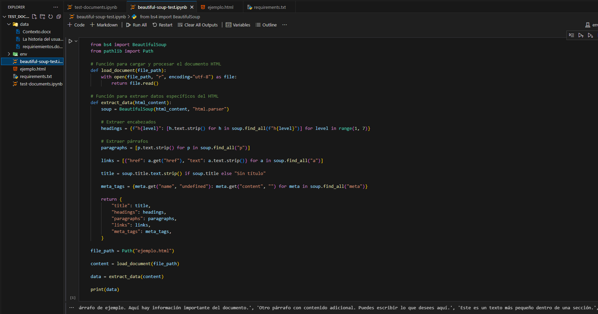

## Ejecutar el macro con UI.Vision desde la terminal

1. Asegurate de tener instalado Google Chrome.
2. Descarga e instala la extensión de UI.Vision en Chrome.
3. Configura el proyecto como se indica.
4. Para ejecutar el macro desde la terminal, utiliza el siguiente comando:

### Windows (CMD)
```shell
start chrome.exe --app="file://$(pwd)/data/tools_json_files/ui.vision/uivision.html?macro=linkedin&storageFolder=$(pwd)/data/tools_json_files/ui.vision&closeRPA=1&direct=1"

start chrome.exe --app="file://<ruta_al_proyecto>/data/tools_json_files/ui.vision/uivision.html?macro=linkedin&storageFolder=<ruta_al_proyecto>/data/tools_json_files/ui.vision&closeRPA=1&direct=1"
```

## Visualizacion de Extraccion de Data con Scraping Tools

## BeautifulSoup



## Diffbot


## MechanicalSoup


## Octoparse


## Scrapy


## Selenium


## Selenium IDE


## UI.Vision


## WebHarvy

